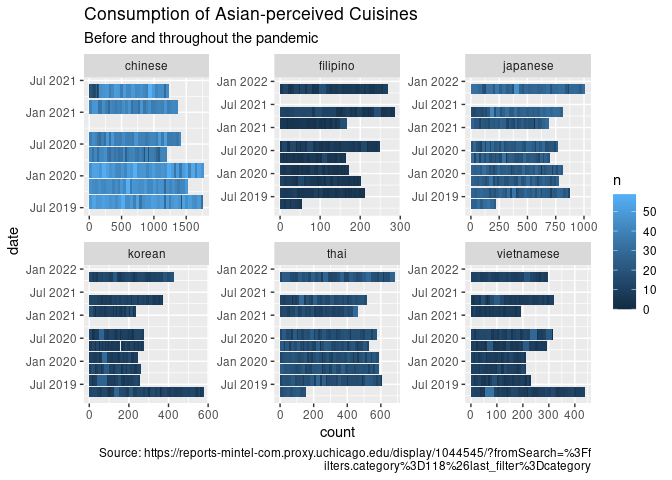
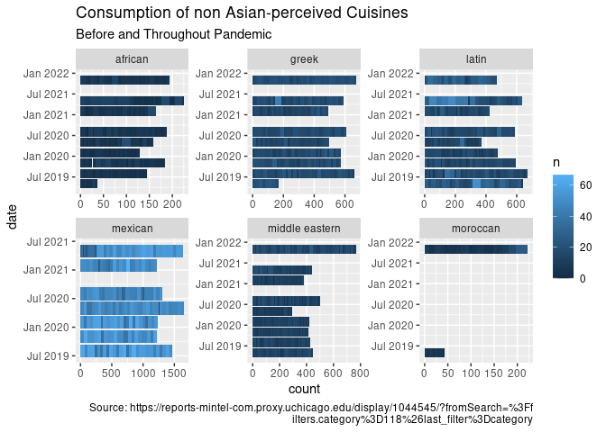
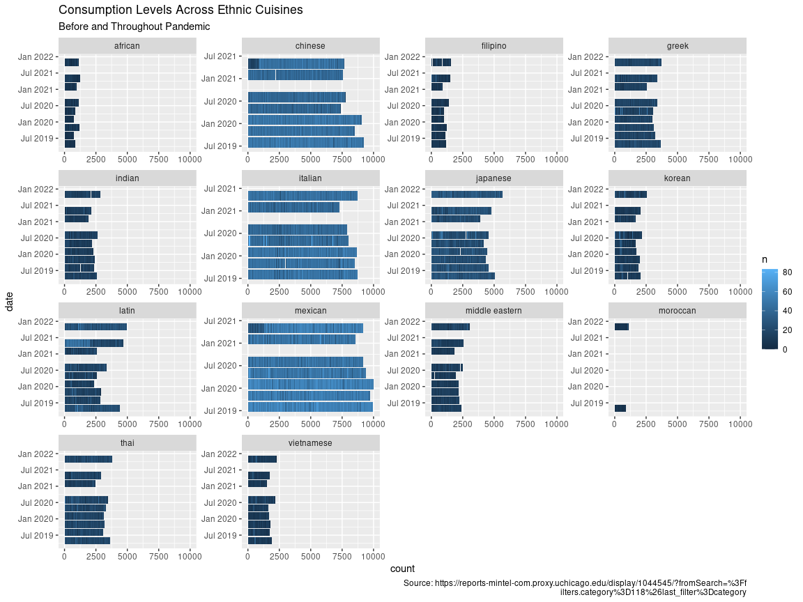
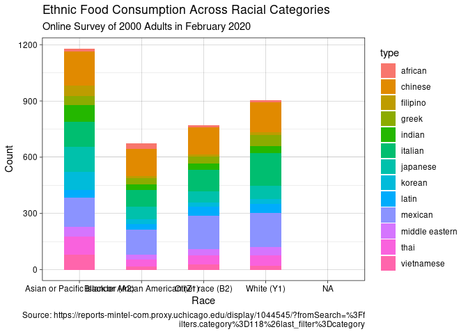
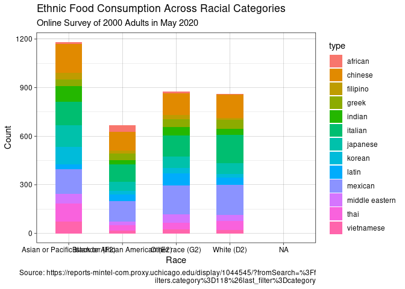
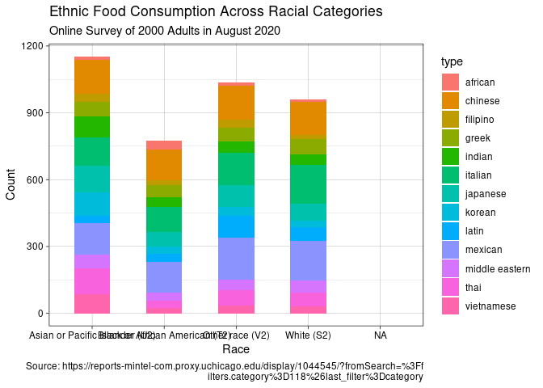

Exploratory Data Visualizations
================
Alana LaBelle-Hahn
12/10/2021

``` r
# Loading in the data
consumer_data <- read_csv("combined_months.csv") 
```

    ## Rows: 76266 Columns: 8

    ## ── Column specification ────────────────────────────────────────────────────────
    ## Delimiter: ","
    ## chr (5): consumption, type, question, demographic, date
    ## dbl (3): n, month, year

    ## 
    ## ℹ Use `spec()` to retrieve the full column specification for this data.
    ## ℹ Specify the column types or set `show_col_types = FALSE` to quiet this message.

``` r
# For some reason, R read in the date column as a character string so here I am
#converting everything back over to numeric...
consumer_data$date <- as.yearmon(paste(consumer_data$year, 
                                       consumer_data$month), "%Y %m")
```

``` r
# I want to create cuisine groups in order to visualize the difference between ethnic food categories

## A group for Asian "perceived" restaurants. Those whose food may associated with 
## certain phenotypes
asian_perceived <- consumer_data %>%
  filter(type == c("chinese", "japanese", "thai", 
                   "vietnamese", "korean", "filipino"))


#A group for non Asian "perceived" cuisines
non_asian_perceived <- consumer_data %>%
  filter(type == c("moroccan", "african", "latin", 
                   "greek", "middle eastern", "mexican"))
```

``` r
# Visualizing differences between cuisine categories


asian_perceived %>%
  group_by(type) %>%
  filter(consumption == "Away from home (eg restaurant, café, etc)") %>%
  ggplot(mapping= aes(x = date, y = n, fill = n)) + 
  geom_col() +
  coord_flip() +
  scale_color_brewer(palette="Dark2") +
  facet_wrap(facets = vars(type), scales = "free") + 
  labs(title = "Consumption of Asian-perceived Cuisines",
       subtitle = "Before and throughout the pandemic",
       y = "count",
       caption = "Source: https://reports-mintel-com.proxy.uchicago.edu/display/1044545/?fromSearch=%3Ff
       ilters.category%3D118%26last_filter%3Dcategory")
```

    ## Warning: Removed 12 rows containing missing values (position_stack).

<!-- -->

``` r
#Replicating the affect with non_Asian perceived

non_asian_perceived %>%
  group_by(type) %>%
  filter(consumption == "Away from home (eg restaurant, café, etc)") %>%
  ggplot(mapping= aes(x = date, y = n, fill = n)) + 
  geom_col() +
  coord_flip() +
  scale_color_brewer(palette="Dark2") +
  facet_wrap(facets = vars(type), scales = "free") + 
  labs(title = "Consumption of non Asian-perceived Cuisines ",
       subtitle = "Before and Throughout Pandemic",
       y = "count",
       caption = "Source: https://reports-mintel-com.proxy.uchicago.edu/display/1044545/?fromSearch=%3Ff
       ilters.category%3D118%26last_filter%3Dcategory")
```

    ## Warning: Removed 6 rows containing missing values (position_stack).

<!-- -->

``` r
#Seeing all the comparisons in panel form - *VERY USEFUL*
consumer_data %>%
  group_by(type) %>%
  filter(consumption == "Away from home (eg restaurant, café, etc)") %>%
  filter(!type == "none of the above") %>%
  filter(!type == "None of the above") %>%
  ggplot(mapping= aes(x = date, y = n, fill = n, na.rm = TRUE)) + 
  geom_col() +
  coord_flip() +
  ylim(0,10000) +
  scale_color_brewer(palette="Dark2") +
  facet_wrap(facets = vars(type), scales = "free") + 
  labs(title = "Consumption Levels Across Ethnic Cuisines ",
       subtitle = "Before and Throughout Pandemic",
       y = "count",
       caption = "Source: https://reports-mintel-com.proxy.uchicago.edu/display/1044545/?fromSearch=%3Ff
       ilters.category%3D118%26last_filter%3Dcategory")
```

    ## Warning: Removed 107 rows containing missing values (position_stack).

    ## Warning: Removed 14 rows containing missing values (geom_col).

<!-- -->

# A USABLE GRAPH!

    ## Warning: Removed 6 rows containing missing values (position_stack).

<!-- -->

    ## Warning: Removed 6 rows containing missing values (position_stack).

<!-- -->

    ## Warning: Removed 6 rows containing missing values (position_stack).

<!-- -->
